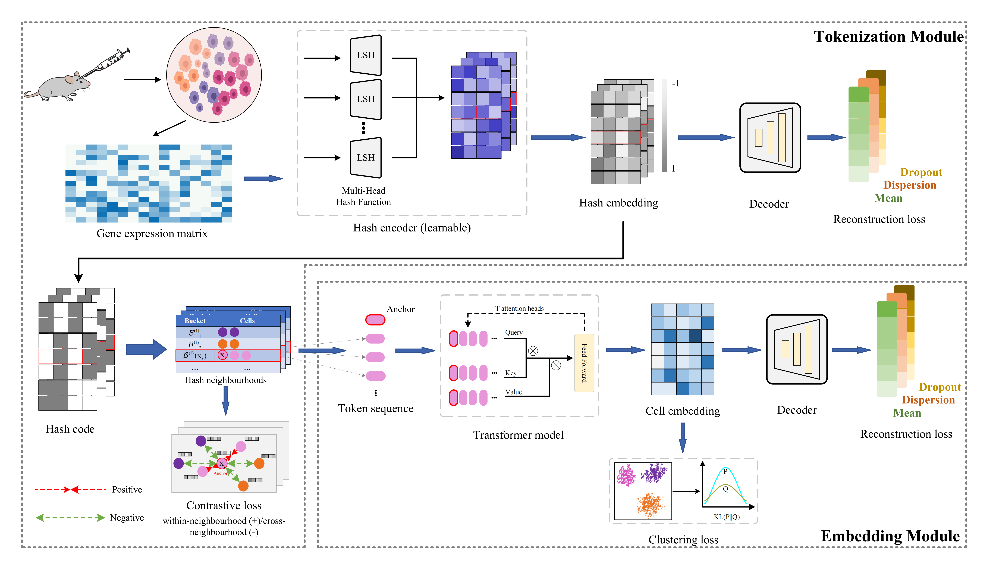

# Fast and Scalable scRNA-seq Clustering via Local Attention
## Abstract
The code of Fast and Scalable scRNA-seq Clustering via Local Attention.
In this paper, we present scHashFormer, which replaces all-pairs computation with learnable locality-sensitive hashing to group transcriptionally similar cells into high-purity hash neighbourhoods in near-linear time. Within each neighbourhood, a lightweight Transformer performs message passing to learn structure-aware embeddings. Training is regularised by a zero-inflated negative binomial (ZINB) objective, removing the need for an explicit global graph. Across datasets spanning 1e4-1e6 cells, scHashFormer outperforms leading methods while reducing runtime and memory by up to an order of magnitude and avoiding out-of-memory failures. The resulting embeddings improve cell-type annotation, better separate rare and transitional populations, enable batch-robust integration without over-mixing, and preserve developmental trajectories consistent with lineage markers. Together, scHashFormer makes million-cell clustering and downstream single-cell analyses routine and reproducible at the atlas scale.

## Architecture
The neural network architecture of scHashFormer. LSH indexer: a multi-head, learnable LSH encoder produces continuous hash embeddings and binary hash codes; identical codes define hash neighbourhoods. A contrastive objective tightens within-neighbourhood similarity and separates cross-neighbourhood pairs, and a ZINB decoder reconstructs counts to retain count-based biology. Affinity encoder (attention-based): for each cell, \emph{tokenised same-neighbourhood cells} are encoded by a lightweight neighbourhood Transformer to obtain structure-aware embeddings; a KL-based head yields soft cluster assignments, and ZINB reconstruction regularises the embedding. The workflow preserves local manifold structure while avoiding the construction of all pairwise relationships.

## Requirements
Creating a conda environment named `env_name` and installing the requirements using pip 
```
$ conda create --name [env_name] python=3.11
$ conda activate [env_name] 
$ pip install -r requirements.txt
```

## Datasets and corresponding configs
Downloading the scRNA-seq data named `dataset_name` to the path `dataset_path` and modifying the `data_dir` in corresponding configuration file `config\[dataset_name].yml` to `dataset_name`.

The specific data file can be downloaded from the following website:
- The Chen data downloaded from [GSE87544](https://www.ncbi.nlm.nih.gov/geo/query/acc.cgi?acc=GSE87544),
- The Bach data downloaded from [GSE106273](https://www.ncbi.nlm.nih.gov/geo/query/acc.cgi?acc=GSE106273),
- The mouse retina cell atlas data (MRCA) downloaded from [UCSC Cell Browser](https://cells.ucsc.edu/muscle-cell-atlas/),
- The human retina - retinal ganglion cells data (HRCA) downloaded from [Single Cell Portal](https://singlecell.broadinstitute.org/single_cell/study/SCP2808/hrca-snrna-seq-of-the-human-retina-retinal-ganglion-cells),
- The human fetal atlas data (Fetal-Atlas) downloaded from [GSE156793](https://www.ncbi.nlm.nih.gov/geo/query/acc.cgi?acc=GSE156793),
- The Human PBMC data downloaded from [Kaggle](https://www.kaggle.com/competitions/open-problems-single-cell-perturbations/data),
- The cardiovascular cell of the healthy Wistar rat data (Ratmap) downloaded from [Single Cell Portal](https://singlecell.broadinstitute.org/single_cell/study/SCP2828/transcriptional-profile-of-the-rat-cardiovascular-system-at-single-cell-resolution),
- The astrocytes cell downloaded from [Neuroscience Multi-omic Data Archive](https://data.nemoarchive.org/biccn/grant/u01_feng/feng/transcriptome/sncell/10x_v3.1/),
- The arabidopsis cell downloaded from [GSE290214](https://www.ncbi.nlm.nih.gov/geo/query/acc.cgi?acc=GSE290214).

## Usage
For the Bach dataset, run
```
$ python main.py --dataset Bach
```

## Citation
